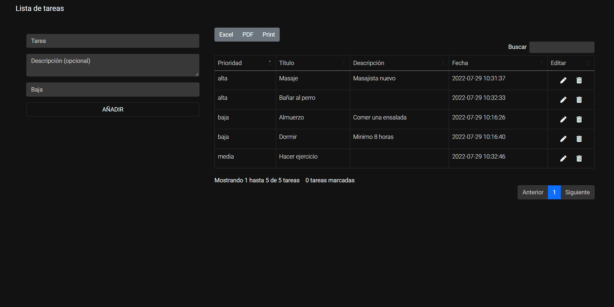

# PHP & MySQL TODO LIST

<strong>Important</strong>: Do not use this proyect in a real production enviroment. This project is susceptible to sql injections and may always be so. This project is only a learning practice.

This project is not made for mobile devices.

## Description

A task list where tasks are stored in a database. 

It is possible to add tasks, edit and delete tasks using Ajax.

It is also possible to paginate, export the tasks in pdf, excel and print them thanks to the datatable library.

## Database 

The database is attached, you can download it or create it.

Be sure to change the parameters to create a successful connection to your database server.

